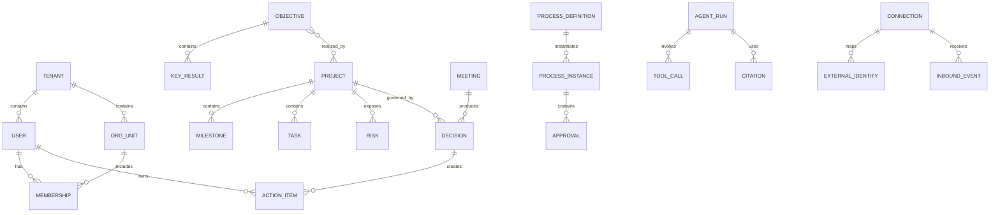

# 03 领域与数据模型

## 1. 领域边界

首期采用模块化单体，按领域模块组织代码和数据库访问：

| 模块 | 主要对象 | 权威职责 |
|---|---|---|
| Identity | Tenant、User、Identity、Session | 租户和身份映射 |
| Organization | OrgUnit、Position、Membership、Delegation | 组织、岗位、成员和授权 |
| Strategy | StrategyTheme、Objective、KeyResult、Metric | 战略目标和度量 |
| Delivery | Portfolio、Project、Milestone、Task、Dependency | 项目执行 |
| Governance | Risk、Issue、Decision、Change | 风险、问题和管理决定 |
| Workflow | ProcessDefinition、ProcessInstance、Approval | 流程与审批 |
| Collaboration | Meeting、ActionItem、Comment、Notification | 协作与行动 |
| Knowledge | Document、KnowledgeItem、Citation | 文档与知识 |
| Agent | AgentProfile、AgentRun、ToolCall、Confirmation | Agent 运行和确认 |
| Integration | Connection、ExternalIdentity、SyncCursor、InboundEvent | 外部连接器 |
| Audit | AuditEvent、SecurityIncident | 不可抵赖审计 |

企业治理扩展对象：`OrganizationChangeCase`、`WorkHandoff`、`ProjectChangeRequest`、`ProjectClosureReview`、`ManagementAttentionItem` 和 `CompensationPlan`。这些对象不是旁路日志，而是组织撤权、项目变更、管理升级、结项和逆向补偿的权威状态机。

## 2. 通用字段

所有租户业务表至少包含：

```text
id UUID/ULID
tenant_id
version
status
created_at / created_by
updated_at / updated_by
archived_at
data_owner_org_id
classification
source_system
source_external_id
```

- `AR-001` 业务 ID 不包含平台用户 ID，外部 ID 通过映射表维护。
- `AR-002` 所有查询必须显式携带 tenant scope。
- `AR-003` 关键对象使用乐观锁 version 防止覆盖更新。
- `AR-004` 审计数据追加写，业务删除不级联删除审计事件。
- `AR-005` 外部事件保存脱敏原始摘要、哈希和解析版本，不长期保存无必要的消息全文。

## 3. 核心关系



## 4. 状态机

### 4.1 项目

`draft → proposed → approved → active → paused → closing → completed|cancelled`

只有 `approved` 后才允许分配正式预算；`completed` 前必须满足验收 Gate。

### 4.2 风险

`identified → assessed → response_planned → monitoring → realized|closed|accepted`

风险必须记录 probability、impact、exposure、owner、response 和 review_at。

### 4.3 决策

`draft → under_review → decided → executing → verified → superseded|closed`

由会议确认产生的决定必须保存 `source_meeting_id`，且租户与项目必须和来源会议一致；行动项通过 `decision_id` 建立“会议 → 决定 → 行动”追溯链。人工独立登记的决定可以没有来源会议。

### 4.4 Agent 动作

`planned → policy_checked → awaiting_confirmation → approved|rejected → executing → succeeded|failed → compensated?`

## 5. 外部身份映射

一个内部用户可映射多个外部身份：

```text
ExternalIdentity
- tenant_id
- connection_id
- provider: feishu | dingtalk | wecom
- subject_type: user | department | chat | app
- external_subject_id
- internal_subject_type
- internal_subject_id
- mapping_status
- verified_at
```

禁止用姓名或手机号在运行时自动合并用户。自动匹配只能生成候选，必须通过可信标识或管理员确认。

## 6. 事件与幂等

InboundEvent 唯一键：`tenant_id + provider + connection_id + external_event_id`。

若平台不提供稳定事件 ID，则使用规范化字段计算幂等哈希，并记录算法版本。处理流程：

1. 验签/解密。
2. 计算幂等键。
3. 持久化接收记录。
4. 快速 ACK。
5. 异步解析和业务处理。
6. 写处理结果、重试状态和审计 ID。

## 7. 知识与引用

企业信息库（E-161）把"企业要长期存放的信息"分成两类，共用同一份底座（`documents` + `document_versions`）：

- **文本型（`kind='text'`）**：正文落在 `document_versions.content`，按段落切块进 `knowledge_items`，可被 Agent 检索。
- **文件型（`kind='file'`）**：协议、合同、标准、表单、证照这类**文件本身**。正文为空（数据库列允许 NULL），
  字节按内容寻址存放在对象存储里（开发默认本地目录 `.nexus-files/`，生产必须显式配置根目录，否则失败关闭），
  版本行保存 `file_name`/`media_type`/`size_bytes`/`storage_ref` 与 sha256 摘要；**不产生 `knowledge_items`**，
  因此文件内容不会进 Agent 检索（将来做文本抽取再单独补一条索引通道）。
- 两类条目共有：密级（public/internal/confidential/restricted）、业务分类（制度/标准/协议/合同/模板/表单/证照/记录/其他）、
  负责人、版本与替代关系（`supersedes_version`）、生效期与失效期、来源引用与一句话摘要。
- **适用范围**：`access_policy` 里保存"对谁生效"——本人白名单、角色、项目，以及**部门**（org unit）与**岗位名**。
  部门/岗位这两个维度是对"实习协议只对实习生、某标准只对某部门生效"的直接表达；判据由请求侧按当前主体解析后传入，
  解析不到即视为不匹配（失败关闭），不会因为查不到组织信息就放宽成人人可见。

KnowledgeItem 不直接等于文件。它保存：

- 来源文档与版本。
- 权限快照和数据分类。
- 有效期、发布状态和替代关系。
- 文本切片和向量索引引用。
- 引用定位信息。

检索结果必须在检索前和返回前各执行一次权限过滤，防止索引侧和生成侧越权。文件下载走**同一套可见性判定**（密级 + 本人/白名单/角色/项目/部门/岗位），
并在返回字节前校验摘要（`storage_ref` 是内容寻址的，摘要不匹配即拒绝返回并报 `FILE_OBJECT_CORRUPTED`）。

候选检索前还必须确认当前文档版本已生效且未过期；返回前重新读取文档头和准确版本，拒绝权限、当前版本或有效期已经变化的结果。引用至少返回 `documentId`、`documentVersion`、`locator`、`sourceRef`、生效/失效时间、数据分类、当前访问依据和检索时间；访问依据只说明 Owner、显式用户、角色、项目或分类规则，不暴露完整 ACL。

## 8. 数据保留

| 数据 | 默认保留 | 说明 |
|---|---|---|
| 业务对象 | 租户策略 | 支持归档和合法删除 |
| 外部事件正文 | 7～30 天 | 原则上仅保留必要字段与哈希 |
| Agent Prompt/Response | 30～180 天 | 可按数据分类缩短或关闭 |
| ToolCall 和确认记录 | 不低于审计要求 | 不保存 Secret |
| 安全审计 | 1～7 年 | 由合规策略决定 |
| 知识索引 | 跟随源文档 | 源权限或版本变化时立即失效 |
