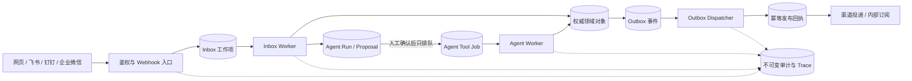
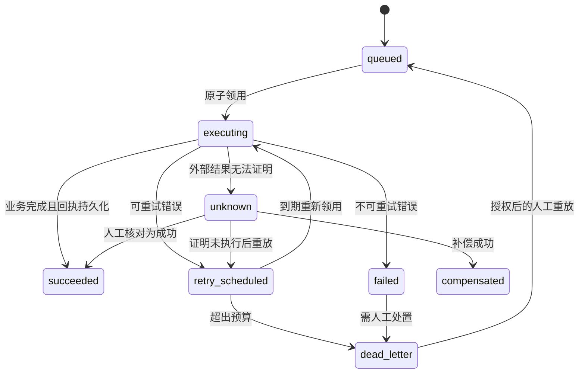

# 16 持久化执行与崩溃恢复设计

> 设计基线：M11 / `0.12.0-durable-runtime`  
> 日期：2026-08-05  
> 状态：运行内核与 `DR-010` 生产工作台事实纪律已实现；全章 Gate 仍以自动化测试、真实 PostgreSQL、容器运行和外部验收记录为准。

## 1. 目标与管理语义

统一办公平台处理的不是普通聊天消息，而是风险登记、决策确认、任务落实、审批推进和通知发布等企业管理事实。一次重试造成的重复风险、一次丢失造成的漏办事项、一次越权恢复造成的错误审批，都会破坏管理闭环。因此，运行时必须保证：

1. 外部平台只负责交互，PostgreSQL 中的领域对象、执行记录和审计记录才是权威事实。
2. HTTP 请求只完成鉴权、校验和持久化受理，不在请求线程中执行高风险业务副作用。
3. 入站事件、Agent 工具任务和出站事件都通过可租约、可重试、可死信、可人工处置的持久化工作项推进。
4. “已接收”“已排队”“执行中”“业务成功”“结果未知”“已死信”必须严格区分，不能用一个模糊的成功状态代替。
5. 所有自动动作都保留发起人、确认人、租户、渠道、对象版本、策略版本、工具版本、Trace 和幂等键。

本章补足 `AR-009`、`AR-010`、`IR-004`、`IR-005`、`IR-006`、`SR-001`、`SR-006` 和 `AC-001` 的持久执行部分，不替代真实企业授权、外部平台 E2E、灾备演练和团队试点。

## 2. 运行契约

| ID | 不可破坏的契约 |
|---|---|
| DR-001 | Webhook 只有在完整统一事件信封已持久化后才返回成功；签名失败、解析失败或数据库失败均失败关闭。 |
| DR-002 | Worker 使用数据库原子领用和独占租约；同一工作项在同一时刻最多只有一个有效租约。 |
| DR-003 | 租约过期后可安全回收；旧 Worker 的过期租约令牌不能完成、重试或死信该工作项。 |
| DR-004 | 每类工作都有有限重试预算、指数退避、可重试/不可重试/结果未知分类和死信终态。 |
| DR-005 | 卡片动作必须重新解析权威渠道身份、平台成员关系、平台角色和当前业务权限，不能信任卡片内自报身份。 |
| DR-006 | Outbox 发布以事件 ID 幂等；发布成功而状态回写前崩溃时，重放不能形成第二条业务事件。 |
| DR-007 | Agent 确认只生成持久化工具任务；确认 HTTP 请求不得直接执行工具副作用。 |
| DR-008 | 工具执行支持成功、明确失败、结果未知、补偿中、已补偿和人工核对；未知结果不得盲目重试。 |
| DR-009 | Readiness 检查真实数据库迁移、必需 Worker 新鲜心跳和实际启用能力；仅存在环境变量不能判定能力可用。 |
| DR-010 | 生产界面不得展示虚构企业、用户、任务、未读数、日期或 Agent 结论；无事实时展示可解释空状态。 |
| DR-011 | Web、Worker、迁移和运维镜像必须来自同一发布版本，并通过兼容窗口校验。 |
| DR-012 | 需求 Gate 必须关联可执行行为证据、失败路径和新鲜运行结果；测试标题出现需求 ID 不是完成证据。 |
| DR-013 | Worker 在关闭时停止领用新任务，完成或释放当前租约，并在超时后由其他实例安全回收。 |
| DR-014 | 队列调度必须具备租户公平、每租户并发上限、积压告警和全局背压，避免大租户饿死小租户。 |

## 3. 端到端执行拓扑

关键事务边界：

- Webhook 事务：统一事件信封 + Inbox 幂等记录。
- 领域写事务：领域对象 + 对应 Outbox 事件；若现有仓储暂不能共享单一事务，则必须使用稳定业务对象 ID 和稳定事件 ID，使崩溃重放可收敛，随后演进为统一 Unit of Work。
- Agent 确认事务：确认记录 + 对象版本快照 + 唯一 Agent Tool Job；不含工具执行。
- 发布事务：Outbox 租约校验 + 幂等发布回执 + Outbox 完成状态。

## 4. 数据模型

### 4.1 Inbox 工作项

`inbox_events` 除现有幂等键和状态外，必须保存：

- 完整 `event_envelope`：provider、connectionId、tenantId、eventType、occurredAt、externalActor、externalContext、payload、rawDigest、schemaVersion、traceId。
- `available_at`、`next_attempt_at`、`attempts`、`max_attempts`。
- `lease_owner`、`lease_token`、`leased_at`、`lease_expires_at`。
- `last_error_code`、`last_error_digest`、`result_digest`、`dead_lettered_at`、`updated_at`。

原始敏感报文默认不保存；仅保存规范化信封和不可逆摘要。确需留存原文时进入独立加密证据库，并服从租户保留策略。

### 4.2 Agent Tool Job

新增 `agent_tool_jobs`，核心字段为：

- `tenant_id`、`agent_run_id`、`proposal_id`、`confirmation_id`。
- `actor_id`、`session_id`、`channel`、`connection_id`、`trace_id`。
- `tool_name`、`tool_version`、`policy_version`、`input`、`input_digest`、`idempotency_key`。
- `object_refs`、`object_version_snapshot`、`risk_level`。
- 状态、重试预算、租约字段、执行结果/错误摘要、未知结果说明和人工处置记录。
- `proposal_id` 唯一，确保重复确认只得到同一任务。

工具输入中需要副作用身份的对象 ID、事件 ID、请求 ID在方案生成时确定并持久化，不能在每次执行时重新随机生成。

### 4.3 Outbox 与发布回执

`outbox_events` 增加租约、重试、死信和结果摘要字段。新增追加式 `domain_event_publications`：

- 以 `outbox_event_id` 唯一，重复发布插入无效但视为幂等成功。
- 保存事件类型、聚合标识、载荷、Trace、发布 Worker 和时间。
- 下游连接器投递若会产生外部副作用，继续生成独立的“通知投递工作项”，不能把内部发布回执误当成外部已送达。

### 4.4 Worker 心跳

`worker_heartbeats` 保存 `role`、`instance_id`、`release_version`、`started_at`、`last_seen_at`、`draining` 和能力摘要。Readiness 要求 `inbox`、`agent`、`outbox` 三类角色均存在版本兼容且未过期的心跳。心跳只证明 Worker 活着，不证明具体业务任务成功。

### 4.5 行级安全与审计

- 所有含 `tenant_id` 的新表启用并强制 RLS。
- Worker 先从租户目录公平选取租户，再在 `withTenant` 事务内领用；不使用应用层绕过 RLS。
- 新表显式安装原子审计触发器，不能假设早期迁移会自动覆盖后建表。
- 工具输入、输出和错误只保存经过分类的结构化摘要；Token、Secret、完整模型上下文和敏感平台原文不得进入审计。

## 5. 状态机

### 5.1 通用工作项

`executing` 只是租约状态，不是业务成功。任何完成状态更新都必须同时匹配 `id + tenant_id + lease_token`。

### 5.2 Agent 运行与提案

- `agent_run`：`created → planning → awaiting_confirmation → queued → executing → succeeded/failed/unknown/cancelled`。
- `proposal`：`pending → approved → queued → executing → executed/failed/unknown/expired/cancelled`。
- 确认前校验方案摘要、过期时间和对象版本；Worker 执行前再次校验确认人权限、策略版本和对象当前版本。
- 对象已变化时不自动沿用旧确认，任务进入 `failed` 或重新生成方案，避免“过期授权”。

## 6. 领用、租约和公平调度

Worker 的单次领用流程为：

1. 从活跃租户中按加权轮转选择候选租户；权重受套餐、积压和每租户并发上限约束。
2. 在租户事务中以 `FOR UPDATE SKIP LOCKED` 选择一条到期工作项。
3. 应用生成不可预测 `lease_token`，原子写入 Worker、开始时间、到期时间并增加尝试次数。
4. 在租约期限内执行；长任务定期续租，续租也必须匹配当前令牌。
5. 完成、重试、未知或死信时以令牌作 compare-and-set；影响行数为零表示租约已失效，旧 Worker 禁止继续写业务终态。

默认值作为初始配置而非硬编码契约：租约 30 秒、轮询 500 毫秒、最大 8 次、退避 1 秒起并带抖动。工具可声明更严格的超时和更小的重试预算。

关闭协议：收到 SIGTERM 后把实例标记为 `draining`，停止领用，等待当前任务到安全点；能安全中断的任务释放租约，不能确认结果的外部调用进入 `unknown`，最后停止心跳。

## 7. Inbox 路由

Inbox Worker 解析持久化的统一事件信封，并按稳定事件类型路由：

- `card.action`：用 `provider + connectionId + externalActor` 调连接器控制面解析内部身份，再装载平台角色、权限和数据范围。确认 Agent 提案时只生成唯一工具任务。
- `message.received`：生成可审计 Agent Run 或业务命令；如果当前场景未启用自动回复，则记录“已接收但无处理器”的明确结果，不能静默丢弃。
- `user.changed`、`department.changed`：进入组织同步流程，应用来源优先级、离职撤权和冲突策略。
- `meeting.changed`、`approval.changed`：归一化为领域事件，再由业务模块决定是否更新权威对象或创建待核对项。
- 未识别事件：不可重试失败并死信，保留 Schema 版本和摘要供连接器升级。

每个处理器以 `inbox_event_id` 作为幂等因果键。重复平台回调、Worker 崩溃重放和人工重放都不能生成第二个业务事实。

## 8. Agent 异步工具执行

### 8.1 确认阶段

确认 API 只完成：

1. 会话和 CSRF 校验。
2. 方案摘要、过期时间、确认人和租户校验。
3. 当前权限、工具风险策略和对象版本校验。
4. 保存确认记录并创建唯一 `agent_tool_job`。
5. 返回 `202 Accepted` 与任务查询地址；重复请求返回同一任务。

### 8.2 执行阶段

Agent Worker 领用后再次校验身份是否仍有效、权限是否被撤销、对象版本是否变化、工具实现版本是否兼容。工具注册契约扩展为：

- 输入/输出 Schema。
- 权限、数据范围和风险等级。
- 超时、重试预算、幂等能力和副作用分类。
- 结果核对器和可选补偿器。
- 是否允许自动重试；无幂等保障的外部写默认不允许。

首个管理闭环 `management.create_risk` 必须在提案阶段固化 `riskId` 和 `eventId`。若 Worker 在风险写入后崩溃，重放用同一 ID执行 UPSERT，并用同一 Outbox 事件 ID完成缺失步骤，最终只形成一个风险事实和一个领域事件。

### 8.3 未知结果

外部请求超时、连接断开或平台返回语义不确定时进入 `unknown`：

- 首先使用外部请求 ID、幂等键或查询接口核对。
- 能证明成功则完成；能证明未执行才允许重试。
- 无法证明时交人工核对，不使用“再点一次”作为恢复手段。
- 补偿操作本身是新的受控工具任务，有独立确认、审计和结果。

## 9. Outbox 发布与渠道投递

Outbox Dispatcher 只负责可靠发布领域事件：

1. 原子领用到期 Outbox。
2. 向 `domain_event_publications` 插入同一事件 ID。
3. 唯一冲突表示此前已发布，按幂等成功处理。
4. 使用当前租约令牌完成 Outbox。

未来接入 Kafka、NATS 或云事件总线时，以同一事件 ID作为消息键，并保留数据库发布回执。连接器消息发送属于另一层投递工作项，至少保存渠道、接收目标引用、模板版本、幂等键、平台请求 ID、回执、重试预算和未知结果，不在 Outbox Dispatcher 内直接拼接平台 API。

## 10. 就绪、遥测与运行控制

### 10.1 存活与就绪

- Liveness：进程事件循环和基础 HTTP 服务可响应。
- Readiness：数据库可读写、迁移达到最低版本、生产身份/Secret/入口防护配置有效、必需 Worker 心跳新鲜且版本兼容。
- 连接器是否真实可用由最新预检证据决定；配置字符串存在只说明“已声明”，不说明“已连通”。
- OTLP 只有在应用实际初始化导出器并产生成功/失败遥测回执时才算启用；仅填写 Endpoint 不通过 Gate。

### 10.2 必备指标

- 每类队列的总深度、最老年龄、领用速率、完成速率、重试率、死信数、未知结果数。
- 租约过期、旧令牌拒绝、每租户积压和公平度。
- Agent 方案确认率、权限撤销拒绝率、对象版本冲突率、工具耗时和补偿率。
- Outbox 发布滞后、通知外部回执延迟、连接器限流和身份解析失败。
- 指标标签不得包含用户输入、文档内容、Secret 或高基数原始对象 ID。

### 10.3 运维控制面

死信重放、结果核对、强制取消和补偿只对特权管理员开放，并要求原因、工单/事故引用和二次确认。所有操作追加审计，禁止直接修改数据库状态绕过控制面。

## 11. 生产界面事实纪律

生产 UI 的每个数字、人员、企业名称、日期、Agent 结论和状态都必须来自已鉴权 API，并带加载、空、失败和权限不足状态。构建/测试必须阻止已知演示字面量进入生产壳层。演示数据只能存在于显式 Storybook、测试 fixture 或 `NEXUS_DEMO_MODE=true` 的隔离环境，且生产 Readiness 必须拒绝该模式。

Agent 回复必须区分：

- 已从权威对象读取的事实。
- 带引用的模型推断。
- 等待确认的建议。
- 已排队但尚未执行的任务。
- 已执行且有业务回执的动作。

## 12. 部署与迁移

`0.12.0-durable-runtime` 至少提供四种同源制品：

- Web/API Runner。
- Inbox/Agent/Outbox Worker Runner，可按角色独立部署和伸缩；`WORKER_ROLES` 还支持 `pi-change-delivery`（变更交付 Outbox）与 `task-reminder`（每租户周期内依次执行：周期进度摘要 → 通知留存清理 → 临期/逾期/阻塞提醒扫描，见 [work-command-center](./18-work-command-center.md) §4.4 与 §4.7；留存口径由 `TASK_NOTIFICATION_RETENTION_*` 配置，默认清理 90 天前的已读通知与 365 天前的全部通知）。未列出的角色值一律 `WORKER_ROLE_INVALID` 失败关闭；`pi-runner` 必须使用专用入口。
- Migration Runner。
- Backup/Restore Operations Runner。

Kubernetes 使用独立 Web 与 Worker Deployment；所有镜像标签和 `release_version` 一致。发布顺序为：备份 → expand 迁移 → Worker 兼容版本 → Web canary → 行为旅程 → 扩容。回滚只回到仍兼容新 Schema 的镜像；数据库采用前向补偿，不执行破坏性回滚。

迁移采用兼容窗口：

1. 新字段可空或有安全默认值，旧进程仍可运行。
2. 新代码双读/按需回填。
3. 完成数据回填与证据验证。
4. 后续版本再收紧约束或移除旧字段。

## 13. 测试与验收

### 13.1 必须自动化的行为旅程

1. Webhook 完整信封落库后才 ACK；数据库失败时不 ACK。
2. 两个 Worker 并发领用时只有一个获得任务。
3. 租约过期可回收，旧令牌无法完成新租约任务。
4. 可重试错误按预算退避，不可重试错误直接死信，未知结果停止自动重试。
5. 卡片确认使用权威渠道身份，并只生成一个 Agent Tool Job。
6. 确认 API 返回时业务风险尚未创建；Agent Worker 执行后才出现。
7. 工具在业务写入后、任务完成前崩溃，重放不产生重复风险或 Outbox。
8. Outbox 在发布回执后、完成标记前崩溃，重放只形成一个发布记录。
9. 权限在确认后撤销，Worker 执行时拒绝副作用并留下审计。
10. 缺失/过期 Worker 心跳或虚假的 OTLP 环境变量使 Readiness 失败。
11. 生产构建不含演示企业、人物、任务、未读数和伪造 Agent 事实。
12. SIGTERM 排空、租户公平、积压告警和死信人工重放有确定性测试。

### 13.2 证据要求

每条 `DR-*` 必须关联：实现位置、自动测试、最近一次运行结果和失败路径。追踪 Gate 解析显式矩阵或机器可读清单，并校验测试确实运行；仅在测试首行写 ID不计证据。

### 13.3 完成边界

M11 本地完成要求：

- `DR-001` 至 `DR-014` 有可执行证据。
- PostgreSQL 集成旅程、完整测试、类型检查、Lint、生产构建、容器健康和运行旅程全绿。
- Kubernetes 清单包含真实 Worker、同版本镜像和心跳就绪策略。
- 原 0.11.0 的历史 fixture 证据保留，但不再被解释为持久执行完成。

M11 完成仍不等于正式生产发布。`AC-001`、`AC-003`、`AC-005`、`AC-006`、`AC-008`、`AC-009` 和 `AC-010` 中要求的真实 IdP、三平台测试企业、恢复/轮换、告警路由、业务 Owner 验收和试点结果，必须在目标环境补证。

## 14. 实施顺序

1. Expand 迁移：工作项字段、Agent Tool Job、发布回执、Worker 心跳、RLS 和审计。
2. 通用租约仓储与错误分类：原子领用、续租、完成、重试、未知、死信。
3. Inbox Worker 与真实卡片确认链路。
4. Agent 确认改为排队，Agent Worker 执行幂等管理工具并支持崩溃恢复。
5. Outbox Dispatcher 与幂等发布回执。
6. Worker Runner、心跳、优雅关闭、Readiness 和遥测。
7. 清除生产演示事实，补齐加载/空/失败状态。
8. 更新部署制品和 Kubernetes，执行自动化、容器、运行旅程和证据 Gate。
