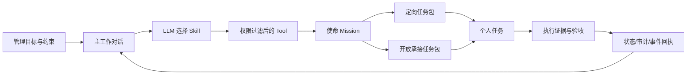

# 18 主对话与实时任务指挥中枢

> 版本：`0.14.0-work-command-center + tiered-memory`  
> 范围：网页端第一入口、可持久主对话、LLM 原生 Skill/Tool 路由、正式任务拆包/分派/承接/交接、轻量消息池与反馈、个人任务实时观察；企业微信继续复用同一 Agent 与工作协同服务。

## 1. 产品形态

首页不再是卡片式仪表盘，也不把 Agent 放在可有可无的侧边抽屉中。工作指挥中枢有三类互不混淆的对象：

1. 主工作对话：企业成员用自然语言描述目标、约束、时限和参与人。对话跨页面持久存在，所有 Agent 入口写入同一条主会话。
2. 正式任务发布栏：同屏显示“我的任务、待承接、我发布、待交接”。任务是执行承诺，必须具备接收对象、产出、验收、时限、能力和容量；模型发起的发布或交接一律先经人工确认。信息尚不完整但用户明确要求“创建/先建/记录”时，先保存为当前用户可见的任务模板，缺失字段可后补，不进入待承接池、不触发正式分派。
3. 消息池：全公司或部门内的沟通、同步、征询和反馈。消息不产生负责人、截止时间、验收标准、任务状态或任务确认；仅按当前身份可见范围显示，并可以在原消息下反馈。

管理看板、经营中枢、项目、审批、组织和知识模块仍是正式业务控制面；主对话负责理解、连接和调度，不另造一套业务事实。

## 2. 企业管理闭环

每个正式任务包必须具备：明确产出、验收标准、所需能力、负责人策略、优先级、截止时间和容量点。信息不完整的创建请求先生成模板，服务端记录 `missingFields`、版本和私有可见范围；补充时按模板 ID + `expectedVersion` 做 CAS 更新，仍保持模板状态，直到用户明确要求正式发布。正式任务只可定向至已验证的个人，或定向至已验证的部门后由该部门成员承接；不能由模型猜测用户或部门 ID。任务发布要求 `work_task:create`，个人定向追加 `work_task:assign`，部门定向追加 `work_task:assign_department` 和数据范围校验；承接时再次校验当前成员或组织范围。任务状态为：

`published → claimed → in_progress → in_review → completed`

定向任务从 `assigned` 开始；执行中可进入 `blocked` 并在解除后回到 `in_progress`。阻塞需要原因，完成需要至少一个证据引用。系统不把“模型说已完成”当成完成证据。

验收是发布人的决定，不是执行人的自助操作：任务进入 `in_review` 后，只有发布人或管理员能把状态推进到 `completed`（通过）或退回 `in_progress`（退回必须填原因）。退回原因（`reviewNote`）与决定（`accept`/`reject`）写入 `work_task_events` 的 `package_status_changed` payload，事件链可追溯。网页“我的/已发布”任务栏提供直连的“提交验收（附证据）→ 通过/退回”按钮；AI 只可起草验收意见，不能代为通过或退回。

任务卡内的子任务（P3）把任务拆成可勾选清单，进度 = 已完成/总数：发布人、承接人和管理员都可新增子任务（每行记录拆分人），勾选完成时可附完成说明与可核验证据引用（格式同任务验收），也可重新打开或删除；每条变更写入 `work_task_events` 的 `package_progress_updated`，网页任务对象带聚合进度 `progress:{done,total}`。若任务已拆分，必须所有子任务完成后才能提交验收（服务端 `WORK_PACKAGE_SUBTASKS_PENDING` 拦截，任务栏同步禁用“提交验收”按钮并显示剩余项）；任务进入 `in_review/completed/cancelled` 后子任务清单锁定（不能再增删改），发布人退回 `in_progress` 后恢复。AI 只负责起草拆分与勾选建议：`work.add_package_subtask`/`work.update_package_subtask` 只生成待人工确认的 R3 提案，不会直接改子任务状态；`work.list_package_subtasks` 为只读核验工具。

发布任务提供双入口：口述/委托走主对话的 Agent（`work.publish_task_bundle`，R3 人工确认）；表单录入直接走任务栏“发布任务”对话框 → `POST /api/v1/task-command/missions`（`source=human`，以当前已认证主体与权限门禁为边界）。表单允许一次使命携带 1..N 个任务包，支持定向分派（指定负责人）或开放承接（可限定部门）；说明/验收标准/所需技能等留空时仍会发布，由服务端标记为“待补充”，不要求录入者先编造内容。

### 2.1 任务交接链

任务交接不是把 `assignee_id` 直接改成另一个人，而是一条可签收的责任链。发起人必须是当前负责人、发布人或具有任务管理权限的主体，并且拥有 `work_task:handoff`；跨部门目标同时要求 `work_task:handoff_cross_department` 和目标部门数据范围。目标必须是当前有效成员。

发起时系统冻结任务版本、任务正文、验收标准、所需能力、当前证据、截止时间，以及交接说明和文件/资料引用。交接处于 `pending` 时原负责人仍保持责任，任务状态不能推进，避免“资料已交出但负责人消失”的空档。只有目标人以 `work_task:accept_handoff` 签收后，才在同一事务中写入交接结果、以版本 compare-and-set 切换负责人并追加实时事件；退回必须保留原因，负责人不变。后续接手人可以再发起下一棒，形成按时间排序、不可覆盖的链。

文件/资料引用在交接记录中是不可变快照，而不是复制文件正文。查看或下载实际文档仍由原有文件对象权限和版本控制决定；Agent 回答交接进度、责任归属或资料连续性前必须通过交接链查询 Tool 读取当前有权可见的记录。

## 3. LLM 原生路由

路由不是关键词分类器，也不是 Python/TypeScript 中的业务 `if/else`。每次请求按以下顺序构造模型上下文：

1. 服务端解析权威身份、租户、渠道、数据范围和当前权限。
2. Context Provider 读取当前项目、目标、风险、行动、个人任务、可承接任务、人员 ID 与容量事实，并明确标记为不可信业务数据。
3. Skill Registry 提供声明式能力说明和使用约束；Skill 只提供认知指导，不直接产生业务副作用。
4. Tool Registry 先按当前权限、渠道、风险等级和禁用策略过滤，再以原生 function/tool definition 交给模型。
5. 模型决定直接回答，或调用一个/多个 Tool。服务端对模型参数执行结构校验、权限重验、风险确认、版本校验、幂等与超时控制。
6. Tool 结果以 tool message 返回模型生成最终答复；UI 同时展示 `上下文 → Skill → Tool → 执行回执`，便于核验实际路线。

确定性代码只负责安全和一致性约束，不替模型做业务语义判断。Prompt Injection 检测属于安全边界，不是业务路由器。

首批 Skill：

- `work-orchestration`：目标拆包、分派、承接、交接和任务推进。
- `management-risk`：风险分析与受确认登记。
- `meeting-preparation`：会议事实包、议程和复盘准备。
- `enterprise-analysis`：基于引用的企业经营分析。
- `company-communication`：把非任务沟通放入当前可见的公司或部门消息池，并支持原位反馈。
- `enterprise-memory`：分级检索用户、任务和情景上下文；长期记忆必须由用户确认写入。
- `knowledge-collaboration`、`process-assistance`：在授权范围内检索知识、准备会议、读取流程和生成只读预审材料。

首批任务 Tool：

- `work.create_task_template`：用已有信息创建当前用户可见的可编辑模板；缺失字段可后补，不正式分派。
- `work.update_task_template`：按模板 ID 和版本补充或修改字段；不会隐式转为正式任务。
- `work.publish_task_bundle`：一次发布一个使命及多个任务包；R2、幂等写入。
- `work.claim_task_package`：以当前任务版本主动承接；R1、compare-and-set。
- `work.update_my_task`：推进本人负责或发布的任务；R2、完成/阻塞证据门禁。
- `work.initiate_task_handoff`：冻结版本、任务快照和文件/资料引用后发起正式交接；R2、强制人工确认。
- `work.respond_to_task_handoff`：由目标接收人签收或退回交接；R2、强制人工确认，签收时原子切换负责人。
- `work.get_task_handoff_trail`：只读查询完整交接链、资料快照和签收结果；R0。
- `communication.publish_message`：R1 消息池推送；不产生任务对象、期限、验收或确认提案。
- `communication.add_feedback`：R1 消息池反馈；只能指向当前可见消息。
- `memory.recall`：R0 检索本人及授权共享的长期记忆。
- `memory.remember`：R2 保存用户明确确认的稳定记忆；共享范围再验权限。
- `office.read_governance_workspace`、`office.read_enterprise_intelligence`、`office.prepare_operating_insight`、`knowledge.search`、`meeting.prepare`、`workflow.read_snapshot`、`workflow.pre_review`：R0 跨企业办公模块的只读依据 Tool。

员工名册 Tool（`organization-member-directory` Skill；只维护员工主数据，**不授予角色、权限或账号能力**，`identity-administration` 仍不向 Agent 开放）：

- `organization.list_members`：只读查询当前租户员工目录（姓名/邮箱/部门/岗位/是否负责人/在职状态/版本）；**默认只返回在职成员**，已停用/离职名单只有管理员可用 `includeDeparted=true` 查看（非管理员请求被拒绝）。R0，回答人员与部门问题、取 memberId 前必须先核验，不得编造。
- `organization.add_member`：登记新员工（入职登记）。**姓名是唯一必填项**，部门/岗位/邮箱可留空并后续补全；未知字段直接留空，不追问、不编造 ID；R1、`organization_member:admin`，写入 users/memberships 并留原子审计。
- `organization.update_member`：补全或修改员工资料（姓名/邮箱/部门/岗位/是否负责人）；先经 `organization.list_members` 取 memberId 与 `expectedVersion`，按版本 CAS 更新；R1、`organization_member:admin`。
- `organization.deactivate_member`：停用/离职。软删除（结束现行任职并标记离职，保留历史任务与审计，不存在物理删除）；仍有进行中任务的成员被服务端拒绝；R2、强制人工确认。
- `organization.reactivate_member`：重新启用已停用/离职成员（恢复在职）。可指定或沿用停用前的部门/岗位/负责人；**只恢复在职与任职**，停用时收回的角色授权、委托、设备与外部身份不自动恢复，需管理员另行授予或重新登录/重新绑定；R2、强制人工确认。

写通道的模型侧纠错：模型给出的 Tool 入参不符合 schema 时，编排器把校验问题回灌给模型重新调用（不计入已执行 Tool），而不是让整轮对话失败；仅当反复失败且从未执行时降级为可读说明。

## 4. 数据与实时性

`0017_work_command_center.sql` 新增五张任务租户表，`0018_work_message_pools.sql` 新增三张消息租户表并为任务包增加部门目标字段，`0019_work_task_handoffs.sql` 新增交接链；`0022_agent_memory.sql` 新增分级记忆：

- `work_conversations`：每位成员最多一个活动主会话。
- `work_conversation_messages`：用户、Agent 与 Tool 消息；按 run/role 幂等。
- `work_missions`：对目标的发布记录；Agent run 维度幂等；模板由 `is_template` 与 `missing_fields` 标记。
- `work_packages`：可分派、承接和验收的最小执行单元；模板包在正式发布前仅对创建者可见。
- `work_task_events`：单调递增 sequence 的任务事件账本。
- `work_pool_messages`：公司或部门池中的轻量沟通内容。
- `work_pool_feedback`：消息下的沟通反馈，不与任务证据混用。
- `work_message_events`：单调递增 sequence 的消息/反馈更新提示。
- `work_task_handoffs`：任务每一棒的责任、冻结任务快照、文件/资料引用、签收/退回结果和 Agent 幂等来源。
- `work_package_tasks`（`0048_work_package_subtasks.sql`）：任务包子任务清单；每行带完成状态、排序、完成人/时间/说明、可核验证据引用与版本，变更随 `package_progress_updated` 事件追加审计。
- `work_task_notifications`（`0049_work_task_notifications.sql`）：每人一份的站内通知；每行绑定收件人、操作人、通知类型、指向的任务包/交接与**触发它的任务事件 ID**，并带 `read_at`。`(tenant_id, recipient_id, source_event_id)` 唯一，避免重放产生重复提醒；写在与业务变更、任务事件相同的事务里，CAS 冲突时不会留下"任务没变但通知发了"的脏数据。
- `agent_memory_entries`：分级对话、上下文、长期、任务和情景记忆；带来源、可见性、数据分级、到期、版本、RLS 与原子审计。详见 [分级记忆设计](./22-tiered-agent-memory.md)。

所有表启用并强制 RLS，业务变更触发原子摘要审计。任务承接和状态更新在同一租户事务中以版本条件更新并追加事件，避免双重承接或“状态变了但事件丢失”。消息池不承担任务治理，但仍保留租户隔离、当前可见范围过滤和审计；其事件流只提示刷新，不含未授权正文。

网页通过 `GET /api/v1/task-command/events` 建立 SSE。客户端可使用 `Last-Event-ID` 或 `after` 游标恢复；服务端每 55 秒主动关闭，浏览器自动重连。SSE 是状态变化提示，页面每次都重新读取权限化 workspace，不能把事件负载当成权威完整对象。单任务卡内的折叠“时间线”通过 `GET /api/v1/task-command/packages/:id/timeline` 读取该任务的 `work_task_events` 流水。

### 4.1 任务进度页（只读）

“任务进度”是任务指挥中枢之外的只读管理视图，与主对话共用同一份服务端事实：

- 看板/表格双形态：看板按状态分列；表格展示任务标题、所属使命/项目、负责人与部门、状态、开始、工期、截止、到期态、容量点，以及存在 `missingFields` 时的“待补充”列。
- 筛选项与导出一致：范围（全部/我负责/我发布）、负责人、使命/项目、状态、仅逾期；导出复用 `GET /reports/export`，服务端按同一组参数过滤行，避免“页面看到的和导出数据不一致”。
- 只读安全：页面与时间线都只做当前身份已授权的读取；任务动作仍回到主对话或任务栏，不绕过 Tool Registry 与人工确认。

### 4.2 开发/内网验证身份切换

单机开发与内网验证部署下，网页侧栏提供“开发验证身份”选择器（仅当服务端开放开发身份时显示，生产未显式开启时该接口失败关闭）。切换后签发签名会话 Cookie（只承载最小身份标识 tenantId/actorId/channel/sessionId，不内嵌权限表；权限每请求由服务端按 actorId 从白名单重建），同一浏览器的后续请求都按所选身份解析租户与权限；切换会重建主对话与任务栏上下文，使“我的/我发布/待承接/待交接”按人隔离可被真实验证。Cookie 保持最小尺寸是为了低于浏览器单 Cookie ~4KB 上限——开发管理员权限集较大，若随 Cookie 内嵌会被浏览器静默丢弃、界面停留旧身份。该能力只用于验证版，正式身份始终走企业 IdP（Authorization Code + PKCE），登录会话同样只带身份引用，授权由服务端解析器每请求重建。

**停用/离职员工的进入权**：成员被停用后（成员管理软删除），其开发验证身份不再出现在切换列表中，切换接口返回 `403 DEMO_IDENTITY_INACTIVE`；此前签发的会话 Cookie 即使验签通过，也会因“已不是在职员工”被鉴权入口拒绝（`401 AUTHENTICATION_REQUIRED`），并且绝不回退成默认管理员身份（否则等于把“已停用”变成提权）。生产路径同样以 `users.status='active' AND archived_at IS NULL` 判定，非在职主体的授权解析直接返回空。停用是软删除：员工档案、历史任务与审计保留，但登录/授权/设备/外部身份入口一并失效。

**重新启用**：`GET /organization/members?includeDeparted=true` 会把已停用成员一并列出（该参数**仅管理员可用**；默认只返回在职成员，普通成员既看不到离职名单，显式索取也会被 403 拒绝），管理员在“成员管理”中对其「重新启用」（`POST /organization/members/:id/reactivate`）：恢复在职身份并重建现行任职，部门/岗位/负责人可指定，留空则沿用停用前任职；`users.archived_at` 清空、版本号递增（CAS）。只恢复“能重新上班”——停用期间被收回的角色授权、委托、客户端设备与外部身份不会自动回滚（停用时原到期时间已覆盖，无法精确还原），需管理员重新授予、重新登录或重新绑定；这也避免一次误停用把权限静默恢复。重新启用后，该身份重新出现在切换列表并可再次登录。

**可见性边界**：员工目录本身按 `organization_member:read` 开放（同事之间能看到在职人员，用于协作与分派），但“谁已离职/被停用”属于敏感人事事实：只有 `organization_member:admin` 能看到已停用名单与状态标识，且停用/重新启用也只能由管理员执行。前端只在 `canManage` 为真时才补取并展示“已停用成员”分区，普通成员看到的目录里根本不含离职行。

### 4.3 站内通知

任务链路上的关键事件会主动提醒到**具体的人**，不需要本人不停刷新：分配给你一个任务、你发布的任务被承接、有人把任务交接给你、你的交接被签收/退回/撤回、有人提交了待你验收、你的提交被验收通过或退回。展示面有两处：工作台右栏的「通知」页签（未读角标、通知列表、逐条「标记已读」与「全部已读」、「查看任务」跳转到对应任务卡）与顶栏的全局铃铛（跨模块可见的未读数）。

实现约定：

- **只提醒当事人**：收件人由服务端按业务事实推导（负责人 / 发布人 / 交接对手方），收件人等于操作人时不产生通知（自己承接自己发布的任务不会提醒自己）；`open_claim` 只挂到部门池时没有收件人，因此不产生通知。
- **不做噪声提醒**：子任务勾选/重开只进任务事件链，不产生通知；临期/逾期/阻塞提醒由常驻 Worker 扫描（见 §4.4）后一并写入消息池与个人通知，两条通道共用同一批候选。
- **同事务**：通知与业务变更、`work_task_events` 审计事件写在同一租户事务内，版本 CAS 冲突时不会出现“任务没变但通知已发”。生产实现由 `withTenant`（`sql.begin`）保证整体回滚；PGlite 集成用例的适配器不包事务，只验证写入顺序与 CAS 早退，异常回滚属代码保证而非测试证据。
- **自读自写**：列表与标记已读只作用于当前会话身份，他人通知 ID 返回 `404 WORK_NOTIFICATION_NOT_FOUND`（与“不存在”同一响应，不泄露存在性）。
- **实时性**：工作台右栏复用现有 `/task-command/events` SSE 触发刷新（触发通知的事件对收件人本就可见），最坏情况由 `useWorkspace` 的 30 秒轮询兜底；顶栏铃铛独立按 30 秒轮询并响应 `nexus:task-command-changed`，本批不新增第二条 SSE 通道。
- **文案**：标题与正文用人话写清“谁需要做什么”，不暴露 `R2`、租户 ID 或内部枚举。

### 4.4 提醒的常驻调度与系统署名

临期/逾期/阻塞提醒不再依赖外部 cron 或开发身份：新增 Durable Worker 角色 `task-reminder`（`WORKER_ROLES=task-reminder npm run worker`），复用 supervisor 的活跃租户枚举、心跳（`worker_heartbeats.role='task-reminder'`，`0050` 迁移放宽角色约束）与 SIGTERM 排空。worker 只做三件事：按租户做间隔节流（`TASK_REMINDER_INTERVAL_MS`，默认 1 小时；扫描失败不推进节流时间，下个周期立即重试）、调用系统扫描入口、把结果写成结构化日志与计数（`task_reminder.scan.total`）。

**系统署名**：定时提醒不是任何同事发出的，也不再借用开发/管理员身份。扫描入口 `runScheduledReminderScan({ tenantId })` 把池消息与通知写成 `author_type/actor_type='system'`、`author_id/actor_id` 为空、`source='system'`（`work_message_events` 同步加 `actor_type`），界面对这类记录显示“系统提醒”。人工/Agent 触发的 `runReminderScan` 行为不变：按调用人署名、`source='agent'`。两者共用同一段扫描实现，避免"人工路径"和"后台路径"各写一套。

**提醒到人**：扫描在发公司池公告之外，还会给当事人写站内通知——临期/逾期给负责人，阻塞升级同时给负责人与发布人（无人承接的公开任务没有收件人，只留池消息）。通知类型为 `task_due_soon`/`task_overdue`/`task_blocked`。

**周期进度摘要**：同一个 worker 角色还负责日报/周报（`TASK_SUMMARY_SCOPE=daily|weekly`，`TASK_SUMMARY_ENABLED=false` 可关闭）。摘要面向**整个租户**——在办任务按状态分布、逾期与临期计数、本周期完成/取消数、逾期最长的三条——以 system 署名发到公司消息池；个人视角继续看工作台「我的」与任务进度看板，不再把个人视图广播到公司池。周期键为 UTC 日期（日报）或当周周一（周报），消息 ID 由「作用域 + 周期」确定（`task-summary:tenant:{scope}:{periodKey}`），worker 另用内存标记避免每个轮询周期都查库；跨进程/重启的重复由确定性 ID 兜底。

**幂等**：池消息沿用“日期 + 任务 + 类型”的确定性 ID；通知没有对应的任务事件行，因此用 `日期 + 任务 + 类型 + 收件人` 的确定性 `source_event_id` 落到 `(tenant_id, recipient_id, source_event_id)` 唯一索引上。摘要用「作用域 + 周期」的确定性 ID。重复扫描或两个实例同时运行都只会留下一条提醒/一条摘要，实测第二次扫描为 `created=0 / notificationsDeduplicated=2`、摘要第二次为 `created=false`。

`scripts/task-reminder.ts` 与 `scripts/task-summary.ts` 保留为手工/一次性入口（`npm run task:reminder` / `npm run task:summary`，均可带 `--tenant <uuid>`；摘要另可带 `--scope weekly`），走同一套系统入口并按租户扫描，不再固定演示租户；两者的 `--watch` 均已移除，常驻场景统一用 Worker 角色。

### 4.5 对话体验：真实阶段进度、一键重试、人话文案

**真实阶段进度（不是假进度条）**：`POST /api/v1/agent/runs?stream=1`（或带 `Accept: text/event-stream`）会边跑边推送服务端真的走到的阶段——`classification`（正在理解你的要求…）→ `context`（正在检索你有权限查看的事实…）→ `thinking`（正在梳理下一步…／正在根据工具结果继续推进…）→ `tool`（正在执行：<所属 Skill 标题>（第 N 步）／已完成…）→ `answer`（正在整理回答…），最后是 `final`（run + proposal）。不预测耗时、不给百分比；事件里的 `label` 由服务端统一生成，客户端只负责显示。工具阶段展示的是工具**所属 Skill 的标题**（如「任务拆解与协同调度」）而不是工具 ID，避免把内部标识暴露给用户；因此 Skill 的 `toolIds` 必须覆盖其全部工具（已补全并有回归测试守住这条不变量）。非流式请求（不带 `stream=1`）保持原有一次性 JSON 契约，企业微信等通道不受影响。

**失败一键重试**：流式通道里服务端失败用 `error` 事件表达（此时响应头已发出），文案与普通 HTTP 通道共用同一份错误映射；页面把失败回复标成可重试并保留原始请求内容，用户点「重试这条请求」即可重发，不需要重新打字。

**文案人话化**：提案卡不再显示 `R3 · 人工确认` 与绝对时间，改为「需要你确认」+「请在 N 分钟内确认，过期需重新发起」；错误与空态文案同样避免内部等级与枚举。

**空态引导**：对话为空时给出一句可点的示例（分派任务／登记新员工／拆解项目），点一下填进输入框，降低"不知道该说什么"的门槛。

### 4.6 纪要文本批量导入任务

「发布任务」对话框有两个页签：**表单录入**（原有路径）与**从纪要批量导入**。后者面向"开完会有一段纪要，想直接变成任务"的场景：

1. 粘贴会议纪要或口头安排（≥10 字）；
2. 点「让 AI 拆成任务草稿」→ 走 `POST /api/v1/agent/task-drafts`（只读，`work_task:create`）：模型按严格 JSON 抽出使命标题、整体目标与多条任务包（标题／说明／验收标准／所需技能／负责人**姓名**／优先级／时间／工期／容量点）；
3. 页面逐条列出候选，可勾选、可看到每条「待补充」的字段与提醒，并填使命标题；
4. 点「发布选中的 N 条」→ 走 `POST /task-command/missions` 的**同一套校验**发布（与表单录入完全一致），未被选中的条目不落库。

坚守的边界：

- **只产草稿**：草稿接口不落库、不发布、不授予权限；集成测试断言草稿前后 `publishedByMe` 数量不变。
- **不编造 ID**：模型只允许返回负责人**姓名**；页面按当前名册解析成 `assigneeId`，解析不到就按公开承接发布并在提示里点名说明（不会静默错配）。
- **不编造时间**：模型给的截止时间必须晚于当前时间（与 E-152 的发布闸门一致），过期或与开始时间冲突就丢弃并标注提醒，而不是让发布阶段撞库约束。
- **模型不可用/返回不可解析时仍可用**：退化为"按纪要条目拆候选"，字段全部待补充，由既有"缺字段不阻断"逻辑继续兜底。
- Agent 侧同一能力为只读工具 `work.draft_tasks_from_minutes`（R0/never），用于对话里"把这段纪要拆成任务"；真正发布仍要经 `work.publish_task_bundle` 的人工确认。

### 4.7 通知的留存清理

站内通知是**投递态**数据，不是业务事实：任务与事件链在 `work_packages` / `work_task_events`（append-only），通知本身对当事人只在短期内有用。不清理的话，按人查询「通知」页签会随分派/承接/交接/验收与每轮临期扫描越来越慢，工作区载荷也越滚越大。

- **两条线**：`readDays`（默认 90 天）清理**已读**通知；`maxAgeDays`（默认 365 天）是**无论已读与否**的硬上限，专门兜住"永远没人点开"的未读通知。硬上限早于读窗口属配置错误，启动即抛 `NOTIFICATION_RETENTION_CONFIG_INVALID`。
- **按批删除**：每批 `batchSize` 条（默认 500，SQL 用 `WITH doomed AS (SELECT … LIMIT n) DELETE … USING doomed`），单租户单次最多 `maxBatches` 批，避免一次锁住太多行、也避免一个租户拖住整个调度周期。每条被删行都会经 `nexus_atomic_audit_change()` 写入 `audit_events`（`action='database.delete'`），所以"通知没了"这件事本身也是留痕的。`0051` 迁移补了 `(tenant_id, created_at)` 索引——0049 的另外两条索引都带 `recipient_id`，而清理是全租户按时间扫，用不上它们。
- **谁触发**：常驻 Worker 角色 `task-reminder` 在同一个租户周期里顺带做这件事，按 **UTC 日期**每租户每天最多一次（与提醒的间隔节流、摘要的周期键并列）；失败不推进"今天已做"标记，下个周期立即重试。手工/一次性入口为 `npm run task:notifications:prune`（可带 `--tenant <uuid>`，默认遍历活跃租户）。
- **开关与口径**：`TASK_NOTIFICATION_RETENTION_ENABLED=false` 整条链路关闭（服务此刻连库都不查）；`TASK_NOTIFICATION_RETENTION_DAYS`、`TASK_NOTIFICATION_MAX_AGE_DAYS`、`TASK_NOTIFICATION_RETENTION_BATCH` 覆盖默认值。环境变量到策略的映射只有一处（`notificationRetentionOptionsFromEnv`），常驻 Worker 与脚本共用，避免两条路径各写一套默认值。
- **不是业务入口**：清理没有 HTTP 也没有 Agent 工具——"删数据"不是同事的业务动作，只由后台调度与运维脚本执行，且严格限定在调用租户内（RLS + `tenant_id` 谓词双重限定）。

## 5. HTTP 契约

| 方法 | 路径 | 作用 |
|---|---|---|
| `GET` | `/api/v1/task-command/workspace` | 读取主会话、消息、人员容量、我的/待承接/我发布任务 |
| `POST` | `/api/v1/task-command/templates` | 创建当前用户可见的任务模板，缺失字段不阻断 |
| `PATCH` | `/api/v1/task-command/templates/{id}` | 按 `expectedVersion` 修改模板字段，仍不正式分派 |
| `POST` | `/api/v1/task-command/missions` | 人工发布一个使命与任务包集合 |
| `POST` | `/api/v1/agent/task-drafts` | 把纪要拆成任务包草稿（只读，不落库；发布仍走 `/missions`） |
| `POST` | `/api/v1/task-command/packages/{id}/claim` | 用 `expectedVersion` 主动承接 |
| `POST` | `/api/v1/task-command/packages/{id}/transition` | 用 `expectedVersion` 推进状态、提交证据或阻塞原因 |
| `GET` | `/api/v1/task-command/packages/{id}/subtasks` | 只读列出子任务与进度（done/total） |
| `POST` | `/api/v1/task-command/packages/{id}/subtasks` | 新增子任务（发布人/承接人/管理员） |
| `PATCH` | `/api/v1/task-command/packages/{id}/subtasks/{subtaskId}` | 勾选完成或重新打开，带子任务 `expectedVersion` |
| `DELETE` | `/api/v1/task-command/packages/{id}/subtasks/{subtaskId}` | 删除子任务，带子任务 `expectedVersion` 查询参数 |
| `GET` | `/api/v1/task-command/packages/{id}/handoffs` | 查询当前身份可见的完整交接链和资料快照 |
| `POST` | `/api/v1/task-command/packages/{id}/handoffs` | 发起正式交接，保留原负责人至目标签收 |
| `POST` | `/api/v1/task-command/handoffs/{id}/response` | 目标接收人签收或退回交接 |
| `GET` | `/api/v1/task-command/events` | 可恢复的实时任务事件流 |
| `GET` | `/api/v1/task-command/notifications` | 只读本人站内通知与未读数（`unreadOnly`/`limit`） |
| `POST` | `/api/v1/task-command/notifications/{id}/read` | 标记本人一条通知已读（幂等） |
| `POST` | `/api/v1/task-command/notifications/read-all` | 一键把本人未读清空 |
| `POST` | `/api/v1/task-command/message-pools/messages` | 直接发布一条公司/部门消息，不创建任务 |
| `POST` | `/api/v1/task-command/message-pools/messages/{id}/feedback` | 对可见消息补充反馈，不改变业务状态 |
| `GET` | `/api/v1/task-command/message-events` | 可恢复的消息池刷新事件流 |
| `POST` | `/api/v1/agent/runs` | 在指定 `conversationId` 中创建主 Agent 运行 |
| `GET` / `POST` | `/api/v1/memory` | 读取或以当前主体明确意图写入长期记忆 |
| `DELETE` | `/api/v1/memory/{id}` | 用版本 CAS 使记忆失效，保留审计链 |

企业微信文本、菜单和卡片动作进入现有连接器身份/验签边界后，调用同一个 Agent Orchestrator 与 TaskCommandService。企业微信不实现自己的关键词分流，不保存另一份任务状态。

## 6. 并发、失败与恢复

- 两人承接同一 `published v1` 任务时，只有第一个 compare-and-set 成功；另一方收到 `409 WORK_PACKAGE_VERSION_CONFLICT`。
- Agent 重试同一 run 的任务发布时，`source_run_id` 唯一约束返回原任务，不创建第二个使命。
- 模型在 Tool 已成功后失联，系统返回确定性 Tool 回执，并标记模型降级，不谎报失败或重复执行。
- 模型不可用且没有 Tool 执行时，只返回安全降级答复；不能根据用户文字在服务端猜测写入动作。
- SSE 断线不会丢业务状态；重连后按 sequence 恢复，再读取 workspace 收敛到权威事实。
- 正式任务发布即使是 R2 也强制进入不可篡改提案与人工确认；人工直发 API 则以当前已认证主体、完整字段、接收对象校验和权限/范围门禁为边界。
- 正式任务交接同样强制进入确认；接收人签收前不改变负责人，交接期间冻结任务版本和状态推进，签收与负责人切换/事件写入同一租户事务。
- R3/R4 动作仍走不可篡改提案、确认和持久 Worker；消息池的 R1 推送仅用于沟通，不能借此绕过任务、审批、项目或其他业务写入策略。

## 7. 当前边界

本地工程已覆盖主会话、任务状态、LLM 原生工具调用、权限过滤、CAS 承接、事件游标、RLS 和审计。**站内通知的边界**：只有站内通道（工作台右栏 + 顶栏铃铛），没有外部推送（飞书/钉钉/企业微信/短信/邮件）与企业 Web Push，没有通知偏好/免打扰设置，没有“已读回执给发起人”，也没有通知留存清理任务（列表默认 30 条、上限 100，表增长靠后续留存项处理）；提醒扫描已由常驻 Worker 角色 `task-reminder` 承接（§4.4），不再需要外部 cron，但生产上仍需按角色部署并保持心跳，Worker 未运行期间不会有新提醒。以下仍属于外部发布 Gate：真实企业微信测试企业中的消息到任务 E2E、真实多成员高并发承接、企业 IdP 即时撤权、目标基础设施恢复/回滚/密钥轮换，以及四周团队试点。开发 Fixture 不代表真实企业数据或生产验收。
